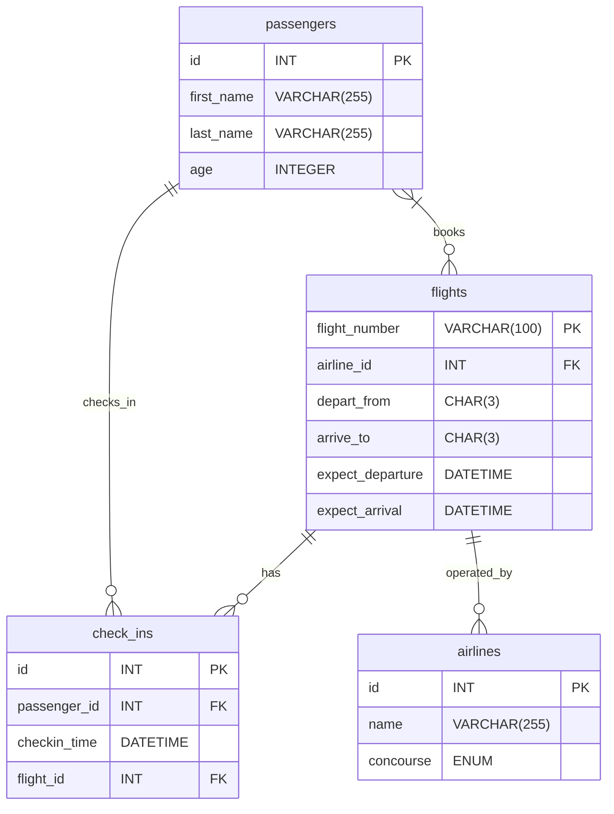

```mermaid
 erDiagram
    passengers {
        id INT PK
        first_name VARCHAR(255)
        last_name VARCHAR(255)
        age INTEGER
    }
    check_ins {
        id INT PK
        passenger_id INT FK
        checkin_time DATETIME
        flight_id INT FK
    }
    airlines {
        id INT PK
        name VARCHAR(255)
        concourse ENUM
    }
    flights {
        flight_number VARCHAR(100) PK
        airline_id INT FK
        depart_from CHAR(3)
        arrive_to CHAR(3)
        expect_departure DATETIME
        expect_arrival DATETIME
    }

    passengers ||--o{ check_ins : checks_in
    passengers }|--o{ flights : books
    flights ||--o{ airlines : operated_by 
    flights ||--o{ check_ins : has
```