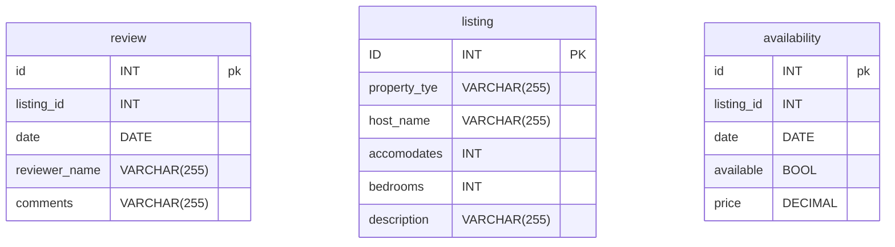

# Problem to Solve
---
A Bed and Breakfast (“BnB” for short!) is a short-term place one might stay and pay the owner for the service, similar to a hotel. Over the past few years, AirBnB has allowed most anyone to rent out their place, whether it’s a home, a cute cottage, or even a treehouse.

You’re a data analyst for the City of Boston and you’re interested in discovering how the rise of AirBnB has changed the local tourist scene. You’ve even compiled a database, bnb.db, filled with data directly from AirBnB. In bnb.db, whip up a few views that will paint a clearer picture of AirBnB’s influence on the city of Boston.

# Schema
---


# Specification
---
> In each of the corresponding .sql files, write a SQL statement to create each of the following views of the data in bnb.db. Note that, while views can be created from other views, each of your views should stand alone (i.e., not rely on a prior view).

### No Description
You might notice that when running
```sql
SELECT * FROM "listings" LIMIT 5;
```

the results look quite wonky! The description column contains descriptions with many line breaks, each of which are printed to your terminal.

In no_descriptions.sql, write a SQL statement to create a view named no_descriptions that includes all of the columns in the listings table except for description.
### One bedroom
In one_bedrooms.sql, write a SQL statement to create a view named one_bedrooms. This view should contain all listings that have exactly one bedroom. Ensure the view contains the following columns:

- `id`, which is the id of the listing from the listings table.
- `property_type`, from the listings table.
- `host_name`, from the listings table.
- `accommodates`, from the listings table.

### available
In available.sql, write a SQL statement to create a view named available. This view should contain all dates that are available at all listings. Ensure the view contains the following columns:

- `id`, which is the id of the listing from the listings table.
- `property_type`, from the listings table.
- `host_name`, from the listings table.
- `date`, from the availabilities table, which is the date of the a vailability.

### frequently reviewed

In frequently_reviewed.sql, write a SQL statement to create a view named frequently_reviewed. This view should contain the 100 most frequently reviewed listings, sorted from most- to least-frequently reviewed. Ensure the view contains the following columns:

- `id`, which is the id of the listing from the listings table.
- `property_type`, from the listings table.
- `host_name`, from the listings table.
- `reviews`, which is the number of reviews the listing has received.

If any two listings have the same number of reviews, sort by property_type (in alphabetical order), followed by host_name (in alphabetical order).


### june vacancies
In june_vacancies.sql, write a SQL statement to create a view named june_vacancies. This view should contain all listings and the number of days in June of 2023 that they remained vacant. Ensure the view contains the following columns:

- `id,` which is the id of the listing from the listings table.
- `property_type`, from the listings table.
- `host_name`, from the listings table.
- `days_vacant`, which is the number of days in June of 2023, that the given listing was marked as available.