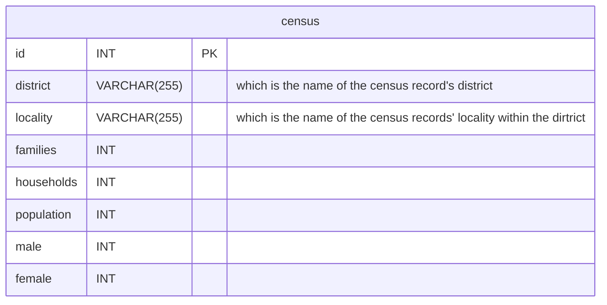

## Problem to Solve
---
You are a census taker working for the Nepali government. As you crest one final hill, your breath catches at the sight of a Himalayan sunrise, casting a glow on the village you’ve journeyed so far to reach. Your guide, a local, halts abruptly. Underneath the steady rustle of your census papers, you feel an itch of curiosity. After all, it’s not every day your job takes you to a village like this one.

## schema
---

## specifications
---
In each of the corresponding .sql files, write a SQL statement to create each of the following views of the data in census.db. Note that, while views can be created from other views, each of your views should stand alone (i.e., not rely on a prior view).

### Rural
In rural.sql, write a SQL statement to create a view named rural. This view should contain all census records relating to a rural municipality (identified by including “rural” in their name). Ensure the view contains all of the columns from the census table.

### Total
In `total.sql`, write a SQL statement to create a view named total. This view should contain the sums for each numeric column in census, across all districts and localities. Ensure the view contains each of the following columns:

- `families`, which is the sum of families from every locality in Nepal.
- `households`, which is the sum of households from every locality in Nepal.
- `population`, which is the sum of the population from every locality in Nepal.
- `male`, which is the sum of people identifying as male from every locality in Nepal.
- `female`, which is the sum of people identifying as female from every locality in Nepal.
### By District
In by_district.sql, write a SQL statement to create a view named by_district. This view should contain the sums for each numeric column in census, grouped by district. Ensure the view contains each of the following columns:

- `district`, which is the name of the district.
- `families`, which is the total number of families in the district.
- `households`, which is the total number of households in the district.
- `population`, which is the total population of the district.
- `male`, which is the total number of people identifying as male in the district.
- `female`, which is the total number of people identifying as female in the district.
### Most Populated
In most_populated.sql, write a SQL statement to create a view named most_populated. This view should contain, in order from greatest to least, the most populated districts in Nepal. Ensure the view contains each of the following columns:

- `district`, which is the name of the district.
- `families`, which is the total number of families in the district.
- `households`, which is the total number of households in the district.
- `population`, which is the total population of the district.
- `male`, which is the total number of people identifying as male in the district.
- `female`, which is the total number of people identifying as female in the district.