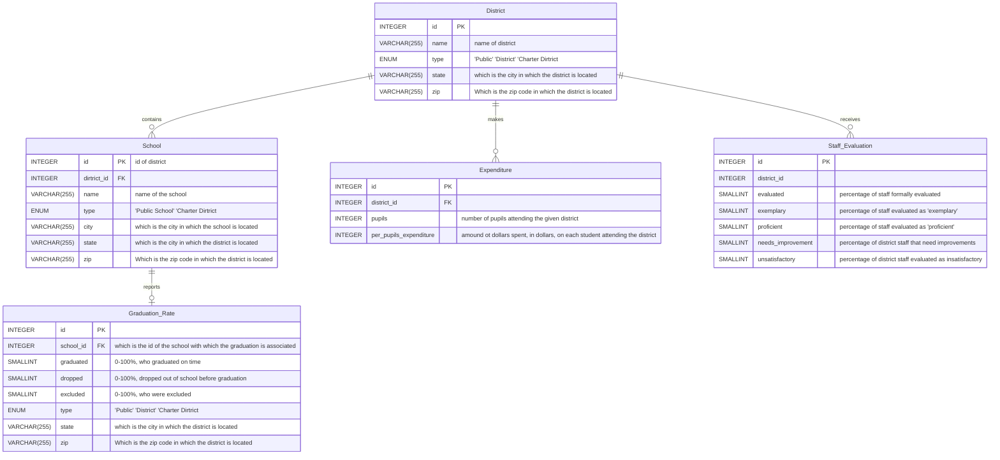

```mermaid
erDiagram
    
    District{
    INTEGER id PK
    VARCHAR(255) name "name of district"
    ENUM type "'Public' 'District' 'Charter Dirtrict"
    VARCHAR(255) state "which is the city in which the district is located"
    VARCHAR(255) zip "Which is the zip code in which the district is located"
    }

    School{
    INTEGER id PK "id of district"
    INTEGER dirtrict_id FK 
    VARCHAR(255) name "name of the school"
    ENUM type "'Public School' 'Charter Dirtrict"
    VARCHAR(255) city "which is the city in which the school is located"
    VARCHAR(255) state "which is the city in which the district is located"
    VARCHAR(255) zip "Which is the zip code in which the district is located"
    }
    
    Expenditure{
    INTEGER id PK
    INTEGER district_id FK
    INTEGER pupils "number of pupils attending the given district"
    INTEGER per_pupils_expenditure "amound ot dollars spent, in dollars, on each student attending the district"
    }

    Staff_Evaluation{
    INTEGER id PK 
    INTEGER district_id 
    SMALLINT evaluated "percentage of staff formally evaluated"
    SMALLINT exemplary "percentage of staff evaluated as 'exemplary'"
    SMALLINT proficient "percentage of staff evaluated as 'proficient'"
    SMALLINT needs_improvement "percentage of district staff that need improvements"
    SMALLINT unsatisfactory "percentage of district staff evaluated as insatisfactory"
    }

    Graduation_Rate{
    INTEGER id PK
    INTEGER school_id FK "which is the id of the school with which the graduation is associated"
    SMALLINT graduated "0-100%, who graduated on time"
    SMALLINT dropped "0-100%, dropped out of school before graduation"
    SMALLINT excluded "0-100%, who were excluded"
    ENUM type "'Public' 'District' 'Charter Dirtrict"
    VARCHAR(255) state "which is the city in which the district is located"
    VARCHAR(255) zip "Which is the zip code in which the district is located"
    }

    District ||--o{ School : contains
    District ||--o{ Expenditure : makes
    District ||--o{ Staff_Evaluation : receives
    School ||--o| Graduation_Rate : reports

```