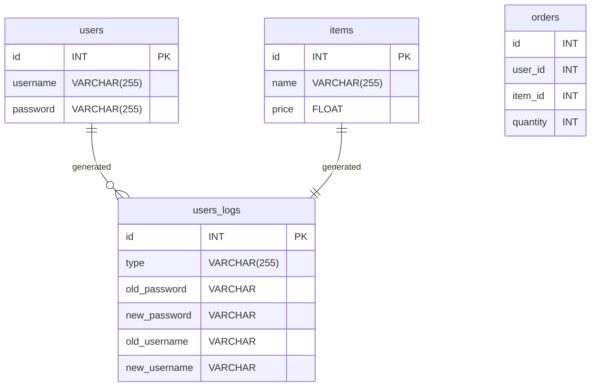

# Problem to Solve
---
You’re a trained “pentester.” Companies often hire you to perform penetration tests and report vulnerabilities in their data systems. Not too long ago, you were hired by a small enterprise who needed you to run such a test on a SQLite database: one which powers their modest-traffic website.

To succeed in this covert operation, you’ll need to…

Alter the password of the website’s administrative account.
Erase any logs of the above password change recorded by the database.
Add false data to throw the company off of your trail.
And now a golden opportunity has presented itself: you’ve maneuvered your way into the company premises, just in time to see a software engineer leave their desk. The engineer’s connection to the database is still open. You estimate you have 5 minutes before they come back. Ready?

# schema
---

# specification
---
In hack.sql, write a sequence of SQL statements to achieve the following:

Alter the password of the website’s administrative account, admin, to instead be “oops!”.
Erase any logs of the above password change recorded by the database.
Add false data to throw others off your trail. In particular, to frame emily33, make it only appear—in the user_logs table—as if the admin account has had its password changed to emily33’s password.
When your SQL statements in hack.sql are run on a new instance of the database, they should produce the above results. Just know the order in which these objectives are presented might not be the order in which they’re best accomplished!

Also keep in mind that passwords are usually not stored “in the clear”—that is, as the plain characters that make up the password. Instead they’re “hashed,” or scrambled, to preserve privacy. Given this reality, you’ll need to ensure the password to which you change the administrative password is also hashed. Thankfully, you know that the passwords in the users table are already stored as MD5 hashes. You can generate quickly generate such hashes from plaintext at md5hashgenerator.com.

Clock’s ticking!