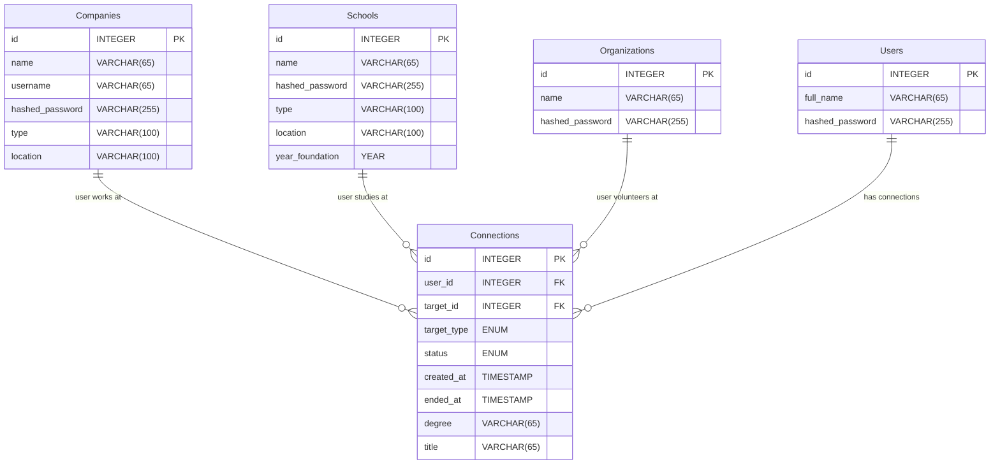

# Problem to Solve
---
You might recall from an earlier problem that LinkedIn is “the world’s largest professional network” with a mission to “connect the world’s professionals to make them more productive and successful.” Odds are, then, they use full-fledged database servers to ensure their platform is highly available around the world.

In a file called schema.sql in a folder called sentimental-connect, write a set of SQL statements to design a MySQL database schema that LinkedIn could use.

# schema
---

---
> Your task at hand is to create a MySQL database for LinkedIn from scratch. The implementation details are up to you, though you should minimally ensure that your database meets the platform’s specification and that it can represent the given sample data. You’re welcome to use, or improve upon, your design of a SQLite database—just keep in mind that you’ll now have a new set of types at your disposal!

## Platform
### Users
The heart of LinkedIn’s platform is its people. Your database should be able to represent the following information about LinkedIn’s users:

- Their first and last name
- Their username
- Their password

Keep in mind that, if a company is following best practices, application passwords are “hashed.” No need to worry about hashing passwords here, though it might be helpful to know that some hashing algorithms can produce strings up to 128 characters long.

### Schools and Universities

LinkedIn also allows for official school or university accounts, such as that for Harvard, so alumni (i.e., those who’ve attended) can identify their affiliation. Ensure that LinkedIn’s database can store the following information about each school:

- The name of the school
- The type of school
- The school’s location
- The year in which the school was founded

You should assume that LinkedIn only allows schools to choose one of three types: “Primary,” “Secondary,” and “Higher Education.”

## Companies
LinkedIn allows companies to create their own pages, like the one for LinkedIn itself, so employees can identify their past or current employment with the company. Ensure that LinkedIn’s database can store the following information for each company:

- The name of the company
- The company’s industry
- The company’s location

You should assume that LinkedIn only allows companies to choose from one of three industries: “Technology,” “Education,” and “Business.”

## Connections
And finally, the essence of LinkedIn is its ability to facilitate connections between people. Ensure LinkedIn’s database can support each of the following connections.

- Connections with People
- Connections with Schools
- Connections with Companies

## Sample Data
Your database should be able to represent…

- A user, Claudine Gay, whose username is “claudine” and password is “password”.
- A user, Reid Hoffman whose username is “reid” and password is “password”.
- A school, Harvard University, which is a university located in Cambridge, Massachusetts, founded in 1636.
- A company, LinkedIn, which is a technology company headquartered in Sunnyvale, California.
- Claudine Gay’s connection with Harvard, pursuing a PhD from January 1st, 1993, to December 31st, 1998.
- Reid Hoffman’s connection with LinkedIn, with title “CEO and Chairman”, from January 1st, 2003 to February 1st, 2007

## Advice
- Consider the full range of MySQL’s supported types, which are documented in the MySQL 8.0 reference manual at dev.mysql.com/doc/refman/8.0/en/data-types.html.
- Also consider the reference manual’s advice on choosing the right type for a column, documented at dev.mysql.com/doc/refman/8.0/en/choosing-types.html.
- Among the high-level pieces of advice is to choose the most precise type for your use case. For instance, if you know an integer column will store only positive values, you should consider modifying the integer type with UNSIGNED (e.g., INT UNSIGNED or TINYINT UNSIGNED) to get the most range out of your type.