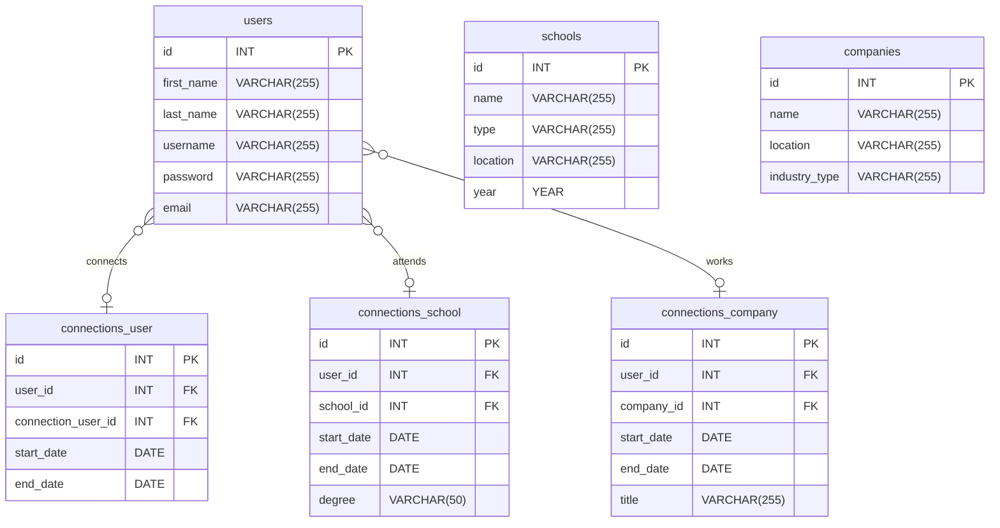

```mermaid
erDiagram
    users {
        id INT PK
        first_name VARCHAR(255)
        last_name VARCHAR(255)
        username VARCHAR(255)
        password VARCHAR(255)
        email VARCHAR(255)
    }
    schools {
        id INT PK
        name VARCHAR(255)
        type VARCHAR(255)
        location VARCHAR(255)
        year YEAR
    }
    companies {
        id INT PK
        name VARCHAR(255)
        location VARCHAR(255)
        industry_type VARCHAR(255)
    }

    connections_user {
        id INT PK
        user_id INT FK  
        connection_user_id INT FK
        start_date DATE 
        end_date DATE 
    }
    
    connections_school {
        id INT PK
        user_id INT FK  
        school_id INT FK  
        start_date DATE 
        end_date DATE 
        degree VARCHAR(50)
    }

    connections_company {
        id INT PK
        user_id INT FK  
        company_id INT FK 
        start_date DATE 
        end_date DATE 
        title VARCHAR(255)
    }

    users }o--o| connections_user : connects
    users }o--o| connections_school : attends
    users }o--o| connections_company : works


```