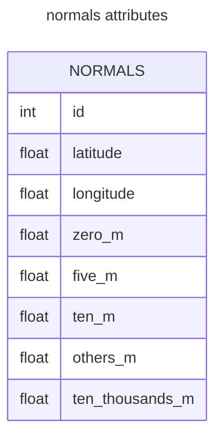

```mermaid
---
title: normals attributes
--- 
erDiagram
    NORMALS{
        int id
        float latitude
        float longitude
        float zero_m
        float five_m
        float ten_m
        float others_m
        float ten_thousands_m
    }
```
