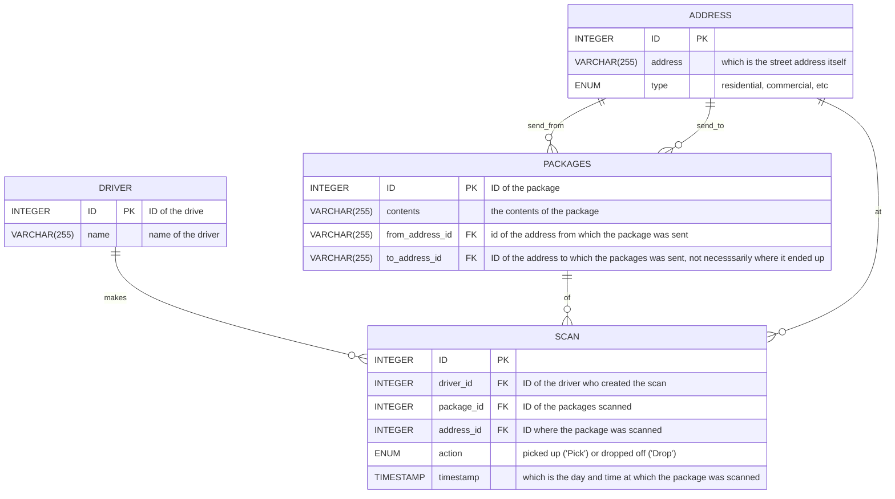

exercice 1 : 
>Clerk, my name’s Anneke. I live over at 900 Somerville Avenue. Not long ago, I sent out a special letter. It’s meant for my friend Varsha. She’s starting a new chapter of her life at 2 Finnegan Street, uptown. (That address, let me tell you: it was a bit tricky to get right the first time.) The letter is a congratulatory note—a cheery little paper hug from me to her, to celebrate this big move of hers. Can you check if it’s made its way to her yet?

exercise 2:
> Good day to you, deliverer of the mail. You might remember that not too long ago I made my way over from the town of Fiftyville. I gave a certain box into your reliable hands and asked you to keep things low. My associate has been expecting the package for a while now. And yet, it appears to have grown wings and flown away. Ha! Any chance you could help clarify this mystery? Afraid there’s no “From” address. It’s the kind of parcel that would add a bit more… quack to someone’s bath times, if you catch my drift.

execice 3 :
> Oh, excuse me, Clerk. I had sent a mystery gift, you see, to my wonderful granddaughter, off at 728 Maple Place. That was about two weeks ago. Now the delivery date has passed by seven whole days and I hear she still waits, her hands empty and heart filled with anticipation. I’m a bit worried wondering where my package has gone. I cannot for the life of me remember what’s inside, but I do know it’s filled to the brim with my love for her. Can we possibly track it down so it can fill her day with joy? I did send it from my home at 109 Tileston Street.