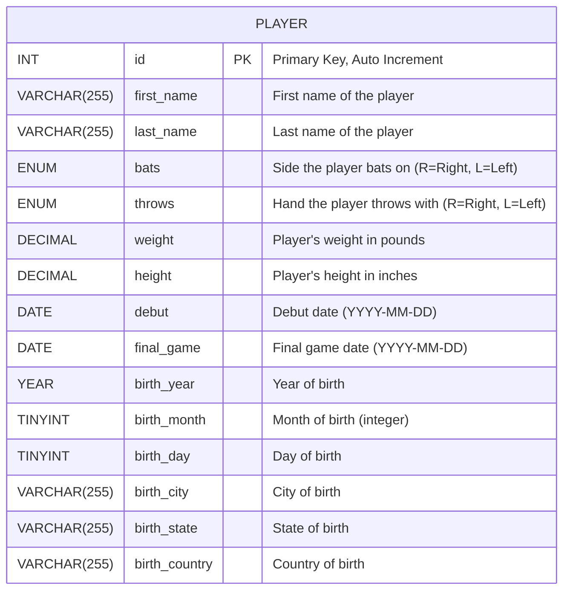

```mermaid
erDiagram
    PLAYER {
        INT id PK "Primary Key, Auto Increment"
        VARCHAR(255) first_name "First name of the player"
        VARCHAR(255) last_name "Last name of the player"
        ENUM bats "Side the player bats on (R=Right, L=Left)"
        ENUM throws "Hand the player throws with (R=Right, L=Left)"
        DECIMAL weight "Player's weight in pounds"
        DECIMAL height "Player's height in inches"
        DATE debut "Debut date (YYYY-MM-DD)"
        DATE final_game "Final game date (YYYY-MM-DD)"
        YEAR birth_year "Year of birth"
        TINYINT birth_month "Month of birth (integer)"
        TINYINT birth_day "Day of birth"
        VARCHAR(255) birth_city "City of birth"
        VARCHAR(255) birth_state "State of birth"
        VARCHAR(255) birth_country "Country of birth"
    }
```